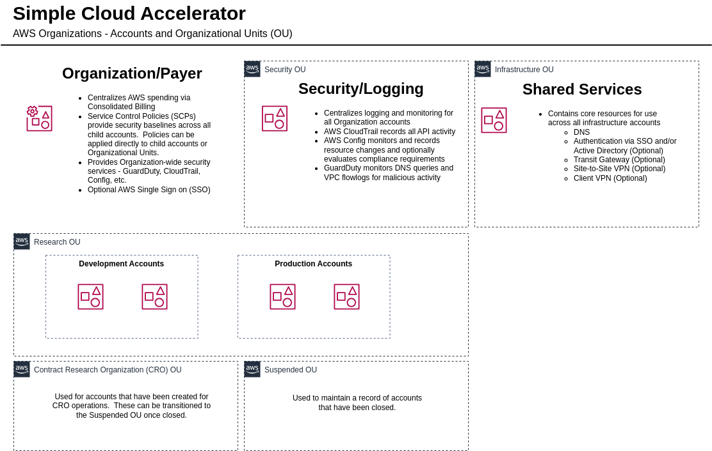
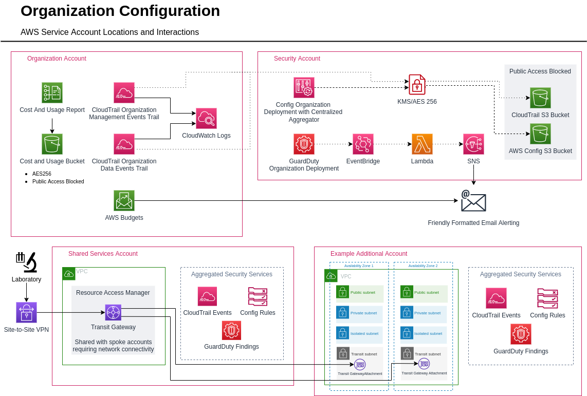

# Simple Cloud Accelerator (SCA) - Artifact

This repository is a point-in-time artifact from the [Third Rock Ventures](https://www.thirdrockventures.com/) and [Tennex](https://tennex.io) collaboration detailed in this [AWS Case Study](https://aws.amazon.com/solutions/case-studies/third-rock-ventures-case-study/).  It is intended for reference only and is not actively maintained.  In the future, an additional public repository will linked here to an extended version that will provide updates and expanded features on a pre-determined release schedule.

This solution, powered by the AWS Cloud Development Kit ([CDK](https://docs.aws.amazon.com/cdk/v2/guide/home.html)) is designed for early to mid-stage HCLS companies. It provides a scalable, best practices multi-account architecture with a focus on security, governance, and Infrastructure as Code (IaC) with the following core services:

- AWS Organizations
- AWS Budgets
- Cost and Usage Reports (CUR)
- AWS CloudTrail
- AWS Config
- Amazon GuardDuty
- Azure AD-backed Authentication via AWS IAM Identity Center (formerly AWS SSO)
- AWS Transit Gateway

This document provides an overview of the solution, as well as the structure of this repository.

For full deployment instructions, visit the [Initial Deployment Instructions](#initial-deployment-instructions) documentation referenced below.

## Environment Architecture

Initially, five Organizational Units (OUs) are defined in AWS Organizations, represented below:

The AWS services are deployed to the accounts using the following architecture:

The images above are located in the [docs/diagrams](docs/diagrams/) directory, and can be edited with [draw.io](https://draw.io).

## Table Of Contents

- [Simple Cloud Accelerator (SCA) - Artifact](#simple-cloud-accelerator-sca---artifact)
  - [Environment Architecture](#environment-architecture)
  - [Table Of Contents](#table-of-contents)
  - [Directory Structure](#directory-structure)
  - [Configuration Files](#configuration-files)
  - [Code Standards](#code-standards)
  - [Prerequisites](#prerequisites)
  - [Initial Deployment Instructions](#initial-deployment-instructions)
  - [Operational Guides](#operational-guides)
  - [Known Issues](#known-issues)
    - [Prefix Lists](#prefix-lists)

## Directory Structure

The directory structure of this repository is outlined below. Files are segregated logically by type and function.

| Directory                                     | Description                                                                                                                                                                                                                                                                                                                                                                                                                                                                 |
| --------------------------------------------- | --------------------------------------------------------------------------------------------------------------------------------------------------------------------------------------------------------------------------------------------------------------------------------------------------------------------------------------------------------------------------------------------------------------------------------------------------------------------------- |
| [bin](bin/)                                   | The parent directory for operations. The [infrastructure.ts](bin/infrastructure.ts) file is the entrypoint for all operations. The file performs configuration validation and deploys any stacks that should exist in _all_ accounts. Following this, account-specific stack deployments [are triggered](bin/infrastructure.ts#L47). For individual account configuration, see [bin/account-stacks/](bin/account-stacks/).                                                  |
| [bin/account-stacks/](bin/account-stacks/)    | A subdirectory containing account-specific configurations. It is segmented with one directory per AWS Region and, inside that Region, one file per AWS account. Each file identifies which stacks are specifically deployed to that account. For example, [security.ts](bin/account-stacks/us-east-1/security.ts) is the source of truth for stacks deployed in the `us-east-1` Region of the `security` account.                                                           |
| [config](config/)                             | Contains the primary configuration files for the deployed environments. This directory can be considered a catch-all for any customized values or configurations that are consumed by the deployments. For example, AWS account names, where to direct notifications, SSO metadata files, etc.                                                                                                                                                                              |
| [lib/aspects](lib/aspects/)                   | Contains [aspects](https://docs.aws.amazon.com/cdk/v2/guide/aspects.html) to enforce configurations on all constructs in a given stack. Aspects are a powerful way to include guardrails directly in the codebase. For example, an aspect may require code to be written such that all S3 buckets are encrypted.                                                                                                                                                            |
| [lib/common](lib/common/)                     | Commonly used stacks that may be deployed in multiple accounts. These stacks deploy different resources based on the property inputs. For example, the [CloudTrail](lib/common/cloudtrail.ts) stack is configured to deploy an organization trail in the Management/Payer account, but deploys a target S3 bucket and KMS key in the security account. The [VPC](lib/common/vpc.ts) stack is reusable, and may be deployed a number of times in any account or Region, etc. |
| [lib/constructs](lib/constructs/)             | Contains common [constructs](https://docs.aws.amazon.com/cdk/v2/guide/constructs.html), which are consumed by stacks.                                                                                                                                                                                                                                                                                                                                                       |
| [lib/custom-resources](lib/custom-resources/) | Contains Lambda custom resources and constructs to deploy them. These resources may be used for deployment orchestration or to supplement AWS API calls where CloudFormation resources may not exist.                                                                                                                                                                                                                                                                       |
| [lib/environments](lib/environments/)         | Contains stacks specific to each respective AWS account. A parallel to `bin/account-stacks`. For example, a stack defining an AWS Cost and Usage Report (CUR) would be placed in `environments/organization` and later referenced in `bin/account-stacks/us-east-1/organization.ts`, as this tool belongs in the Organization Management account.                                                                                                                           |
| [lib/helpers](lib/helpers/)                   | Utility functions that may be consumed by other files, custom resources, etc., to support deployments.                                                                                                                                                                                                                                                                                                                                                                      |

## Configuration Files

These files contain crucial configuration items to ensure a successful deployment, and are referenced in various portions of the deployment documentation.

| Filename                                     | Description                                                                                                                                                                                        |
| -------------------------------------------- | -------------------------------------------------------------------------------------------------------------------------------------------------------------------------------------------------- |
| [config/coreConfig.ts](config/coreConfig.ts) | Contains the core configuration for AWS accounts and other AWS environment objects.                                                                                                                |
| [config/ssoConfig.ts](config/ssoConfig.ts)   | Contains generated AWS Identity Center values.  See [AWS IAM Identity Center](docs/guides/aws-sso/readme.md) for more details.
| [config/taggingConfig.ts](config/taggingConfig.ts) |  Tagging details and Tagging Policy enforcement.                                                                                                                                                                           |
| [lib/types.ts](lib/types.ts)                 | Contains custom [interfaces](https://www.typescriptlang.org/docs/handbook/interfaces.html) and [types](https://www.typescriptlang.org/docs/handbook/basic-types.html) specific to this deployment. |

## Code Standards

Code standards are managed via [ESLint](https://eslint.org/), extending [eslint-config-standard](https://www.npmjs.com/package/eslint-config-standard). See the [.eslintrc.js](.eslintrc.js) file for more information and cross-reference rules at [eslint.org](https://eslint.org/docs/rules/).

## Prerequisites

Before executing any operations, the following prerequisites **must** be met:

- The CDK has a prerequisite that Node.js v18+ be installed. Node.js can be downloaded for your operating system [here](https://nodejs.org/en/download/).
- The CDK must be installed. Visit the [AWS Documentation](https://docs.aws.amazon.com/cdk/v2/guide/getting_started.html#getting_started_install) for instructions.
- The shell environment variable `AWS_PROFILE` must be set, or the CDK CLI `--profile` must be set.
- The associated AWS profile must have a `region` set (e.g., `us-east-1`).
- NPM packages must be installed. Use `npm install-clean` to install packages.
- [Create a new AWS account](https://docs.aws.amazon.com/accounts/latest/reference/manage-acct-creating.html) in which to host the deployment. This will serve as the Payer/Management account for the Simple Cloud Accelerator.
  - _NOTE: This process applies to NEW DEPLOYMENTS **ONLY**. Deploying this solution in an exiting AWS Organization is **NOT** supported by this solution and should be done with extreme caution._

## Initial Deployment Instructions

For full deployment instructions, visit the [Initial Deployment](docs/deployment/initial-deployment.md) documentation.

## Operational Guides

Use the guides below for additional context and operational examples.

- [CDK Operations](docs/guides/deployment/readme.md) - General stack deployment and CDK CLI operations.
- [Accounts](docs/guides/accounts/readme.md) - AWS account creation, import, and baseline deployments.
- [Networking](docs/guides/networking/readme.md) - Networking overview and common operations (e.g., VPC deployment, adding routes, etc.).
- [AWS IAM Identity Center](docs/guides/aws-sso/readme.md) - Managing AWS SSO groups, permission sets, and account assignments.
- [AWS Organization Service Control Policies](docs/guides/organization/service-control-policies.md) - SCP availability and assignment.
- [Amazon GuardDuty](docs/guides/guardduty/readme.md) - GuardDuty configuration and management.

## Known Issues

### Prefix Lists

Prefix lists are created in the Shared Services account as part of the deployment. These prefix lists are **not** used in the VPCs deployed by this solution. They are created for future use, as prefix lists are not currently supported in CloudFormation for [AWS::EC2::Route](https://docs.aws.amazon.com/AWSCloudFormation/latest/UserGuide/aws-resource-ec2-route.html) or [AWS::EC2::TransitGatewayRoute](https://docs.aws.amazon.com/AWSCloudFormation/latest/UserGuide/aws-resource-ec2-transitgatewayroute.html) resources.

Track this [GitHub Issue](https://github.com/aws-cloudformation/cloudformation-coverage-roadmap/issues/572) for updates on prefix list support in CloudFormation.

Use prefix lists where possible when performing manual operations.
