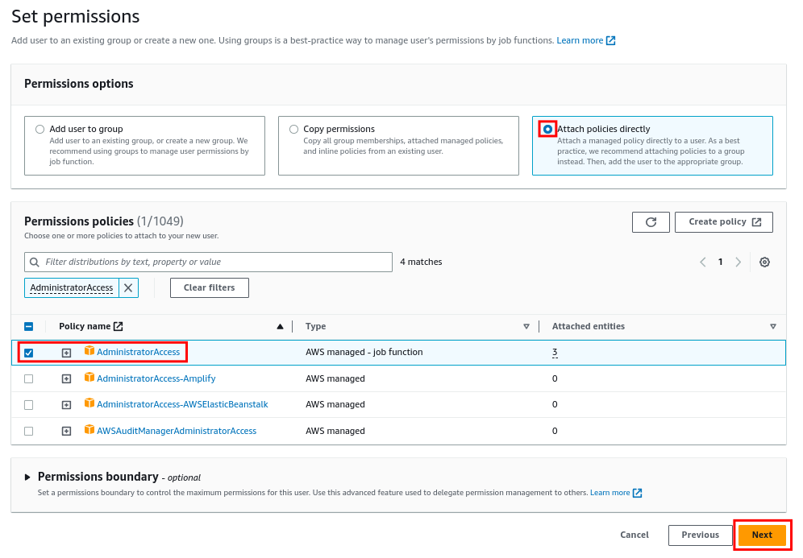

# Create an IAM Deployment User

After logging in with the AWS root account, add a deployment user in the [IAM Dashboard](https://console.aws.amazon.com/iamv2/home?/users/create#/users/create). Name the user `sca-deployment-admin` and click **Next**.


Select **Attach policies directly** on the next page, add a filter for `AdministratorAccess`, check the **AdministratorAccess** policy, and click **Next**.



Review the user details on the next page and click **Create user**.

Now that the user has been created, you must generate Access Keys to use the AWS CLI. Open the [IAM user settings](https://console.aws.amazon.com/iamv2/home?/users/details/sca-deployment-admin?section=permissions#/users/details/sca-deployment-admin?section=permissions) for the `sca-deployment-admin` user and click the **Security credentials** tab.


Scroll down to `Access keys` and click **Create access key**.


Select `Command Line Interface (CLI)`, check that you understand the recommendations, and click **Next**.


On the next page, optionally set a description and click **Create access key**.

You’ll be presented with the Access Key ID and the Secret Access Key.


Next, configure a new AWS CLI entry for your generated credentials in your shell.

```bash
aws --profile sca-deployment-admin configure
```

Follow the prompts, entering the Access Key ID first and Secret Access Key second. Specific the desired default region as well. In this example, we’ll be deploying to `us-east-1`.


This completes the initial user setup. [Click here](initial-deployment.md#enable-aws-organizations-and-populate-core-configuration) to return to the initial deployment document.
