# Simple Cloud Accelerator Deployment

- [Simple Cloud Accelerator Deployment](#simple-cloud-accelerator-deployment)
  - [Requirements](#requirements)
  - [Organization Account Configuration](#organization-account-configuration)
  - [Enable AWS Organizations and Populate Core Configuration](#enable-aws-organizations-and-populate-core-configuration)
    - [Budget Baseline](#budget-baseline)
    - [CloudTrail](#cloudtrail)
    - [AWS Config](#aws-config)
    - [Service Control Policy Region Restrictions](#service-control-policy-region-restrictions)
    - [Organization](#organization)
    - [GuardDuty](#guardduty)
    - [IAM Access Key Monitor](#iam-access-key-monitor)
  - [Tagging Configuration](#tagging-configuration)
  - [Organization Operations](#organization-operations)
  - [Update AWS CLI Profiles](#update-aws-cli-profiles)
  - [CDK Deployment](#cdk-deployment)
  - [Final Console Steps](#final-console-steps)
  - [Cost Allocation Tagging](#cost-allocation-tagging)
  - [AWS IAM Identity Center (SSO) Configuration](#aws-iam-identity-center-sso-configuration)
  - [Completion](#completion)

## Requirements

Before deploying, the AWS CDK must be installed on your system. Reference the [prerequisites](../../README.md#prerequisites) section of the primary readme for instructions.

This document assumes you have already created a brand new AWS account, which we'll be configuring as a Payer account. This new account will host the new Organization, and enable us to deploy and maintain the Simple Cloud Accelerator (SCA). This account is referred to in this document as the "Organization" account, and can also be thought of as a "Payer" or "Management" account. See the [AWS Organizations FAQs](https://aws.amazon.com/organizations/faqs/) for more information.

Do not follow these steps if you already have an existing Payer account and Organization.

## Organization Account Configuration

The deployment process begins in the AWS Organization account. Log into the [AWS Console](https://portal.aws.amazon.com) with your root account and complete the following tasks:

- Enable Multi-Factor Authentication (MFA)
  - Follow the latest [AWS Instructions](https://docs.aws.amazon.com/accounts/latest/reference/root-user-mfa.html).
- Enable IAM Access to Billing Information

  - By default, only the AWS root account can access billing details if this setting is not updated. Activating IAM access allows AWS Identity Center Roles with billing access to view billing information.
  - In the [AWS Account Settings](https://us-east-1.console.aws.amazon.com/billing/home#/account), scroll down to the **IAM user and role access to Billing information** and click **Edit**.
    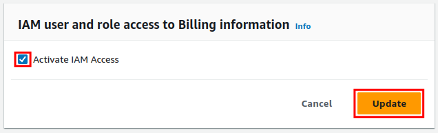

    Check the box next to Activate IAM Access and click **Update**.

  - Create an IAM user with AdministratorAccess to execute the deployment. Follow [these instructions](create-deployment-user.md) and return here when complete.

## Enable AWS Organizations and Populate Core Configuration

In this step, we'll populate some of the SCA configuration. For this step, you'll need the following:

- The SCA's core configuration file open. This file is located at [config/coreConfig.ts](../../config/coreConfig.ts).
- A shell terminal open. All commands should be executed from the root directory of this repository.

Entries which require configuration in the core configuration file (`coreConfig.ts`) are stubbed with `REQUIRES_CONFIGURATION` as a value. Each of these settings is enumerated below.

### Budget Baseline

The `baseBudget` object contains defaults for all budgets. Update the `accountEmailTargets` array to the email(s) that should receive daily budget alerts.

### CloudTrail

The `cloudTrailDetails` object allows the customization of CloudTrail trails and the associated S3 configuration. In this section, set the `cloudtrailOrganizationBucketName` to a unique name for your organization-wide CloudTrail S3 bucket. S3 buckets must conform to [AWS Bucket naming rules](https://docs.aws.amazon.com/AmazonS3/latest/userguide/bucketnamingrules.html). It is recommended to use all lowercase letters and hyphens (-) as a general rule.

### AWS Config

Like CloudTrail, the `awsConfigDetails` object allows the customization of the AWS Config service. Set the `configOrganizationBucketName` value to the name for your organization-wide Config bucket. S3 buckets must conform to [AWS Bucket naming rules](https://docs.aws.amazon.com/AmazonS3/latest/userguide/bucketnamingrules.html). It is recommended to use all lowercase letters and hyphens (-) as a general rule.

### Service Control Policy Region Restrictions

In the `organizationScpDetails` object, set the value of `allowedRegions` to the AWS Regions in which you intend to operate. All other Regions will be disabled, and inaccessible to users.

### Organization

In this step, you will use AWS Organizations to create a new Organization and populate identifiers in the core configurations `organizationDetails` and `accounts` object.

First, using the `sca-deployment-admin` user you created earlier, create an Organization using the AWS CLI.

```bash
aws --profile sca-deployment-admin organizations create-organization
```

This command will output several details you'll copy into the core configuration in a later step. The example output below highlights the essential source values.

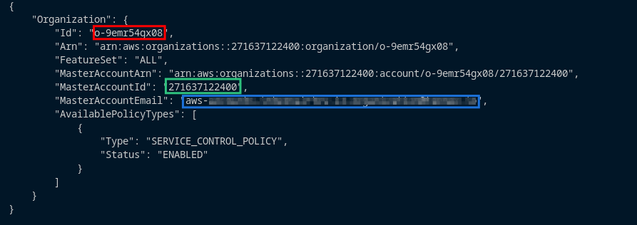

Next, we'll need to collect the Organization Root ID. This ID is required to link future Organizational Units (OUs) under the top of the Organization tree.

```bash
aws --profile sca-deployment-admin organizations list-roots --query 'Roots[].Id' --output text
```

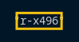

Propagate the values from the last two commands into the core configuration file (`config/coreConfig.ts`) file as follows:

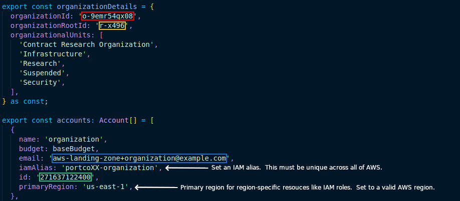

While in the core configuration file, set the desired IAM alias and your primary Region for the Organization account. The IAM alias is human-readable name for your AWS account, and the primary Region simply dictates where base resources are deployed. After that, we'll populate some values used to create the rest of the accounts.

Just below the Organization account, in the `accounts` object, several other accounts will need initial values to support account creation. Set the values of `REQUIRES_CONFIGURATION` to your desired values. Use the color key below for reference.

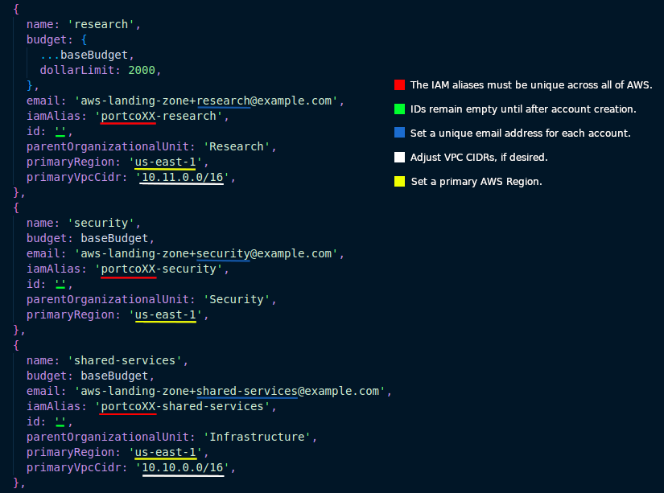

### GuardDuty

For the `guardDutyDetails` object, enter the email(s) that should receive GuardDuty alerts in the `snsAlertEmails` array. The `securityAccountDetectorId` value is updated later in the deployment process.

### IAM Access Key Monitor

This solution includes a mechanism to monitor the age of IAM access keys across the Organization. In the `iamAccessKeyAgeCheckDetails` set the `snsEmailTargets` array to email addresses that should receive alerts with users with keys in violation. Reports are delivered weekly, on Friday. The report will not be delivered if there are no keys in violation.

## Tagging Configuration

Tagging consistency and enforcement are managed in the [config/taggingConfig.ts](../../config/taggingConfig.ts) file. Up to 6 tags can be set, which are monitored for compliance via AWS Config, and optionally enforced via an AWS Organizations Tag Policy.

Open the [config/taggingConfig.ts](../../config/taggingConfig.ts) file, and set the required tags and their allowed values in the `requireTags` object.

The `tagEnforcement` object is used to manage the AWS Organizations Tag Policy. Use the IDE Intellisense to infer the documentation for each property and adjust as needed.

Finally, set the tags for the core S3 buckets for this solution. S3 tagging for these buckets is maintained in this file for ease of updating should the tags change.

Once tagging is complete, you're ready to start deploying!

## Organization Operations

In this step, we’ll begin the deployment by creating additional accounts and Organizational Units to house them.

Before deploying the CDK code in the Organization account, the account must be [bootstrapped](https://docs.aws.amazon.com/cdk/v2/guide/bootstrapping.html) for use with CDK. Bootstrapping allows the CDK the proper permissions to execute API operations in the account.

In this deployment, a bootstrap helper script is used via `package.json` that runs the CDK bootstrap with the additional tags specified in the tagging configuration file. Those tags keep the bootstrap S3 buckets in compliance with the AWS Config `required-tags` rule.

For the remainder of this section, we'll set the AWS_PROFILE environment variable to use our `sca-deployment-admin` profile. Setting the AWS_PROFILE environment variable simplifies operations by removing the need to add —profile to all commands.

Bootstrap and deploy the Organization Core stack using the shell commands below.

```bash
export AWS_PROFILE=sca-deployment-admin
npm run bootstrap
cdk deploy organization-core
```

Once that completes, you'll have four accounts, with three being in the proper OUs. Below is a representation of the accounts and Organization structure.

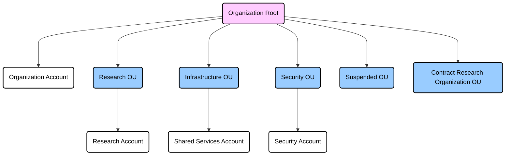

With the new accounts created, their IDs must be back ported into the core configuration file. Run the following AWS CLI command to collect the account names and IDs:

```bash
aws organizations list-accounts --query 'Accounts[].[Name, Id]' --output text | sort
```

The example output will look like this:

```bash
Organization    271637122400
Research        127207110245
Security        750606003679
Shared Services 227081986542
```

In your IDE, you'll want to update the account IDs for research, security, and shared-services in the core configuration file as pictured below.

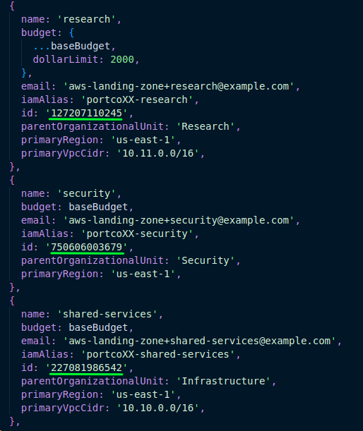

## Update AWS CLI Profiles

_NOTE: All commands should be executed from the root directory of this repository._

Now that the accounts are created, we'll need to adjust our AWS CLI profile entries to get into each account. These profiles will leverage the [Organization Access Role](https://docs.aws.amazon.com/organizations/latest/userguide/orgs_manage_accounts_access.html) to deploy the SCA into the new accounts. Execute the following command to generate CLI profile entries for the new spoke accounts:

```shell
AWS_PROFILE=sca-deployment-admin npm run generate-deployment-profiles
```

Open your CLI profile configuration on your local desktop at `~/.aws/config` and add the profile output under the existing deployment user.

## CDK Deployment

Using the profile names above, CDK bootstrap the remaining AWS accounts. Bootstrapping will allow the deployment of CDK stacks.

```bash
AWS_PROFILE=research npm run bootstrap
AWS_PROFILE=security npm run bootstrap
AWS_PROFILE=shared-services npm run bootstrap
```

Once bootstrapped, deploy the `organization-services` stack in the Organization account:

```bash
AWS_PROFILE=sca-deployment-admin cdk deploy organization-services oam
```

Enter `y` when prompted for changes.

This stack enables several organization-wide services and delegates security functions (CloudTrail, Config, and GuardDuty) to the security account. Now that GuardDuty administration has been delegated to the Security account, a GuardDuty detector will have been created. We'll need the Detector ID to copy into the core configuration file:

```bash
AWS_PROFILE=security aws guardduty list-detectors --query 'DetectorIds[]' --output text
```

Copy the output of the above command and set it as the value of the `securityAccountDetectorId` key.

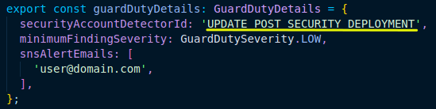

Once the security services are delegated to the security account, deploy all stacks in all accounts in the following order:

```bash
AWS_PROFILE=security cdk deploy config cloudtrail iam-roles -c deployConfigOrganizationAggregator=false
AWS_PROFILE=sca-deployment-admin cdk deploy config
AWS_PROFILE=sca-deployment-admin cdk deploy --all
AWS_PROFILE=shared-services cdk deploy --all
AWS_PROFILE=research cdk deploy --all
AWS_PROFILE=security cdk deploy --all
```

Again, enter `y` when prompted for changes.

Finally, execute the following to purge default VPCs from the new accounts:

```shell
npm run remove-organization-default-vpcs
```

This is only required once, and will happen automatically with new accounts going forward. The script will prompt you for confirmation before running.

## Final Console Steps

In the **Organization** account, enable AWS SSO in the [dashboard](https://console.aws.amazon.com/singlesignon/home).

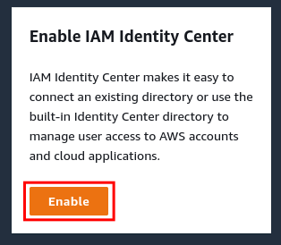

In the [Billing Preferences console](https://console.aws.amazon.com/billing/home?#/preferences), click **Edit** for both **Invoice delivery preferences** and **Alert preferences**.

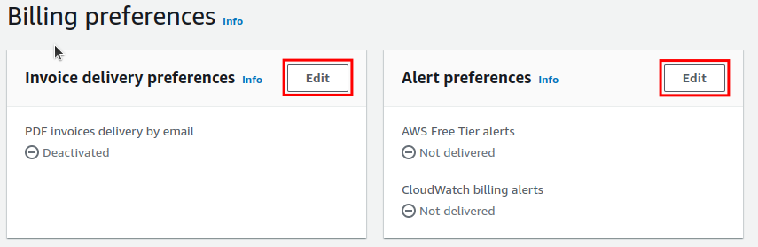

Check the box next to **PDF Invoices delivered by email** and **CloudWatch billing alerts** then click **Update** on each respective widget.

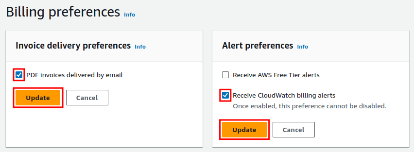

## Cost Allocation Tagging

_NOTE: This step must be executed at least 24 hours AFTER initial deployment._

This step will need to be completed the **day after deployment** to allow for data to accumulate.

[Cost and Usage Reports](https://docs.aws.amazon.com/cur/latest/userguide/what-is-cur.html) (CURs) were created during the deployment. These reports will run within 24 hours and contain the required tags for your Organization. Once the first report runs, the required tags must be enabled as [Cost Allocation Tags](https://docs.aws.amazon.com/awsaccountbilling/latest/aboutv2/cost-alloc-tags.html) (CATs).

To enable CATs, open the [Cost allocation tags dashboard](https://console.aws.amazon.com/billing/home?#/tags) in the Organization account.

In the **User-defined cost allocation tags** tab, select the required tag keys for your Organization, and click **Activate**.

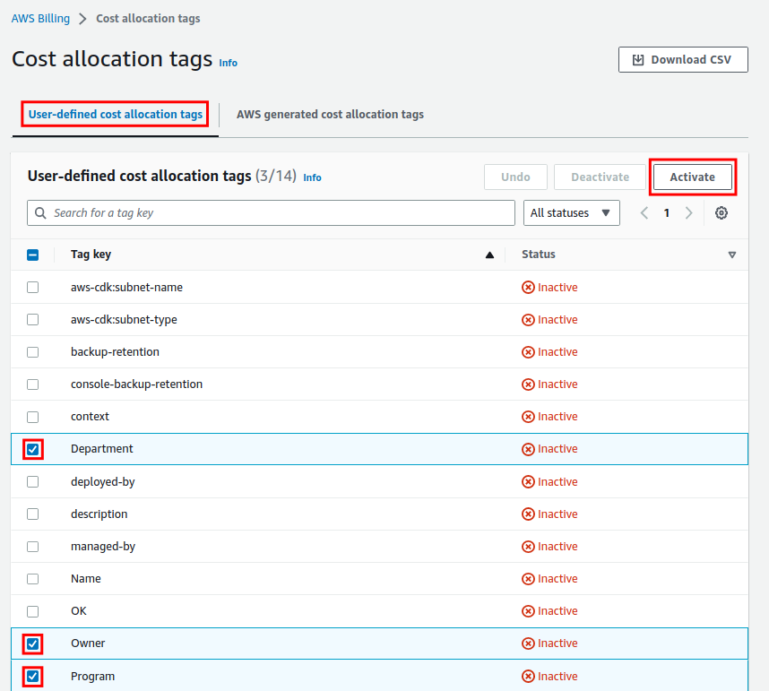

## AWS IAM Identity Center (SSO) Configuration

If your organization will be managing users directly in AWS IAM Identity Center and not via an external Identity Provider such as Okta or Azure AD, follow the  [SSO and Client VPN documentation](sso-setup-vpn.md) to configure AWS Identity Center and Client VPN.

## Completion

Congratulations, you've successfully deployed the Simple Cloud Accelerator! There's plenty more to configure. Navigate back to the [primary readme](../../README.md#operational-guides) to learn about additional operations, such as launching new accounts, deploying infrastructure, etc.
