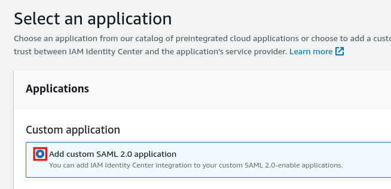
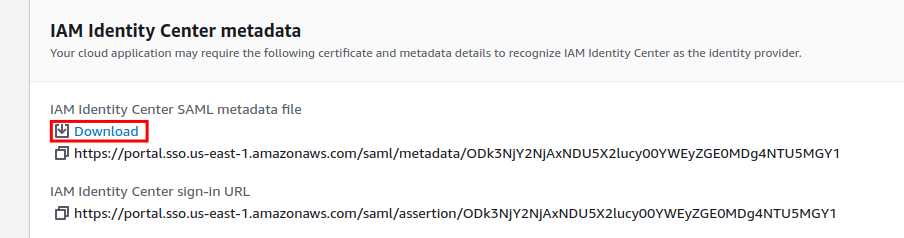
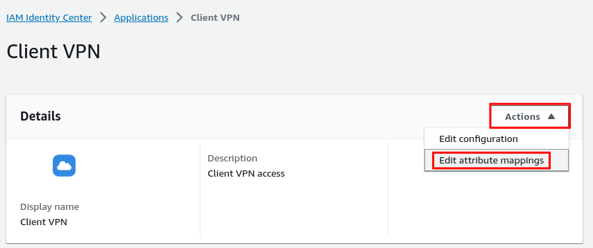
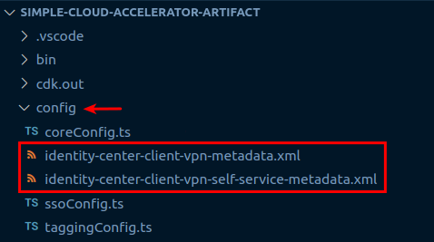

# AWS IAM Identity Center (SSO) Configuration

- [AWS IAM Identity Center (SSO) Configuration](#aws-iam-identity-center-sso-configuration)
  - [Purpose](#purpose)
  - [Group Creation and Assignment](#group-creation-and-assignment)
  - [Client VPN](#client-vpn)
  - [Self-Service Portal](#self-service-portal)
  - [Caveats](#caveats)
    - [SSO Login Page Buttons](#sso-login-page-buttons)

## Purpose

These instructions are intended to provide temporary ingress via AWS IAM Identity Center (successor to AWS Single-Sign On), referred to here as "AWS SSO" or simply "SSO".  The steps below are for organizations using AWS IAM Identity Center without an existing SSO provider such as Okta or Azure AD.

## Group Creation and Assignment

We'll need to create groups via the AWS CLI before we can manage them with the CDK. Run the following to create the appropriate administrator groups.

```shell
export AWS_PROFILE=sca-deployment-admin
IDENTITY_STORE_ID=$(aws sso-admin list-instances --query 'Instances[].IdentityStoreId' --output text)
aws identitystore create-group --display-name admin-all-accounts --identity-store-id "$IDENTITY_STORE_ID"
aws identitystore create-group --display-name organization-admin --identity-store-id "$IDENTITY_STORE_ID"
aws identitystore create-group --display-name research-admin --identity-store-id "$IDENTITY_STORE_ID"
aws identitystore create-group --display-name security-admin --identity-store-id "$IDENTITY_STORE_ID"
aws identitystore create-group --display-name shared-services-admin --identity-store-id "$IDENTITY_STORE_ID"
```

Next, create a user for yourself in the [AWS SSO Console](https://us-east-1.console.aws.amazon.com/singlesignon/home?region=us-east-1) and assign yourself to the `admin-all-accounts` group. After logging in, you will _not_ see any applications. This is expected behavior.

Once your user has been created, the CDK can take over managing the group/account/permission set assignments. Execute the following commands to import the SSO groups into the `config/ssoConfig.ts` file, then deploy the SSO stack:

```shell
AWS_PROFILE=sca-deployment-admin npm run sso-update
AWS_PROFILE=sca-deployment-admin cdk deploy sso
```

Now that group assignments are complete, your SSO user has console access and you can also leverage this user for CLI commands. Execute the following to generate AWS CLI profiles for the SSO tenant:

```shell
AWS_PROFILE=sca-deployment-admin npm run generate-sso-profiles
```

Update your CLI profiles per the script output to complete the SSO implementation.

## Client VPN

Client VPN will also temporarily use AWS SSO for authentication.

Log into the **Organization** account and open the [SSO application addition dashboard](https://us-east-1.console.aws.amazon.com/singlesignon/applications/home?region=us-east-1#/add).

Since AWS SSO custom SAML applications only support a single ACS URL, you'll need to use the following instructions **_twice_**.

1. The first application will support VPN authorization and have an ACS URL of `http://127.0.0.1:35001`.
1. The second application will support authorization to the Self-Service Portal and have an ACS URL of `https://self-service.clientvpn.amazonaws.com/api/auth/sso/saml`.

**Again, perform the instructions below _twice_. Once for each custom SAML application.**

Select **Add a custom SAML 2.0 application** and click **Next**.



Download the **IAM Identity Center SAML metadata file**.



Depending on which of the two SAML applications you are provisioning, save the file with the corresponding file name in the repository:

| Application                       | Value                                                       |
| --------------------------------- | :---------------------------------------------------------- |
| VPN Authorization                 | config/identity-center-client-vpn-metadata.xml              |
| Self-Service Portal Authorization | config/identity-center-client-vpn-self-service-metadata.xml |

The application properties can stay blank.

Next, update the **Application metadata** section to match the following values:

| Name                      | Value                            |
| ------------------------- | :------------------------------- |
| Application ACS URL       | For the VPN Authorization app use `http://127.0.0.1:35001`<br>For the Self Service Portal app use: https://self-service.clientvpn.amazonaws.com/api/auth/sso/saml         |
| Application SAML audience | urn:amazon:webservices:clientvpn |

Click **Submit**.

In the next screen, you'll update the attribute mappings.  Again, this is required for **both applications**.

Click the **Actions** button and select **Edit attribute mappings**.



| User attribute in the application | Maps to this string value or user attribute in AWS IAM Identity Center | Format       |
| --------------------------------- | ---------------------------------------------------------------------- | :----------- |
| Subject                           | ${user:email}                                                          | emailAddress |
| Name                              | ${user:email}                                                          | unspecified  |
| FirstName                         | ${user:givenName}                                                      | unspecified  |
| LastName                          | ${user:familyName}                                                     | unspecified  |
| memberOf                          | ${user:groups}                                                         | unspecified  |

Click **Save changes.**

Assign your user or a group to the applications.

Confirm that each downloaded SAML metadata file is in the proper location in the repository:



Run the following to deploy Client VPN in the `Shared Services` account to complete the setup:

```shell
AWS_PROFILE=shared-services cdk deploy client-vpn
```

## Self-Service Portal

Users can now log into the Self-Service Portal using their SSO credentials.  The Self-Service Portal is deployed in the `Shared Services` account.  Use the following CLI command to retrieve the URL:

```shell
aws --profile shared-services ec2 describe-client-vpn-endpoints \
    --query 'ClientVpnEndpoints[].SelfServicePortalUrl' \
    --output text
```

## Caveats

### SSO Login Page Buttons

The Identity Center login page will display two additional buttons, one for each SAML application created during this deployment.  These buttons are not functional and clicking on them will result in an error.  It is not possible to remove these buttons from the login page.
