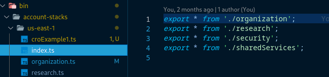

# Account Baseline Deployment

- [Account Baseline Deployment](#account-baseline-deployment)
  - [Prerequisites](#prerequisites)
  - [Process](#process)
    - [Account Stack Creation](#account-stack-creation)

This process outlines the steps to fully integrate an account after creation or import. This step is crucial, as it ensures the new account will have all necessary guardrails applied to it.

## Prerequisites

The following details are required for a proper import:

- The account has been successfully created or imported into the Simple Cloud Accelerator (SCA).
- There is a working AWS CLI profile for the account (an example AWS SSO entry is provided below).

  _Example AWS SSO entry:_

  ```text
  [profile example-company-cro-1]
  sso_start_url = https://example-company.awsapps.com/start
  sso_region = us-east-1
  sso_account_id = 320131628732
  sso_role_name = AWSAdministratorAccess
  region = us-east-1
  ```

## Process

The following SCA account stacks must be updated:

- **Organization:** Budgets stack. A budget will be created for the new account based on the settings in the [core configuration file](../../../config/coreConfig.ts).
- **Security:** CloudTrail, Config, and GuardDuty stacks. Changes here will allow S3 delivery and encryption operations for CloudTrail and Config. The GuardDuty deployment will be integrated at the Organization level.
- **Shared Services:** If a Transit Gateway has been deployed, it will be shared with the new account via the Resource Access Manager (RAM) service.

  _Example Deployment:_

  ```shell
  AWS_PROFILE=<ORGANIZATION_admin_profile>  npx cdk deploy --all
  AWS_PROFILE=<SECURITY_admin_profile>  npx cdk deploy --all
  AWS_PROFILE=<SHARED_SERVICES_admin_profile> npx cdk deploy --all
  ```

### Account Stack Creation

After completing the deployments above, create a new stack file for the new account. This is the file that determines what specific stacks are deployed in the new account.

Utilize a copy of the [stack template](../../../bin/account-stacks/stack-template.ts) file to begin defining the stacks you'd like to deploy in the new account.

The name of this file must match the "friendly" name of the account in the [core config file](../../../config/coreConfig.ts) or, if the account name contains hyphens, must be converted to `camelCase`. In this example, `cro-example-1` becomes `croExample1` and we must create a file named `croExample1.ts`.

Example

  ```shell
  # From the repository root directory, using us-east-1 as an example
  cd bin/account-stacks/us-east-1

  # Name the target file the same name as the account from the core config file

  # In cases where the account name has hyphens, convert to camelCase.
  cp ../stack-template.ts croExample1.ts
  ```


Edit the `croExample1.ts` file you've just created and update the class name to match the core config account name:


After saving that file, add an export in the `index.ts` file at `bin/account-stacks/us-east-1/index.ts`:



This addition exposes the new stacks to the `infrastructure.ts` file that drives all deployments.

The following image highlights the file names, locations, and how they relate:


Once complete, execute the following steps to bootstrap, baseline, and enable AWS Config in the new account:

```shell
export AWS_PROFILE=<CRO1_admin_profile>
npx cdk bootstrap
npx cdk deploy --all
```

You're now ready to deploy additional custom infrastructure by creating new CDK stacks in the `bin/account-stacks/us-east-1/croExample1.ts` file.
