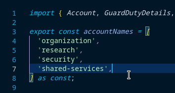

# Account Creation

- [Account Creation](#account-creation)
  - [Prerequisites](#prerequisites)
  - [Process](#process)

The Simple Cloud Accelerator (SCA) manages the process of adding a new account.

## Prerequisites

The following details are required for a proper import:

- A complete SCA deployment.
  - _NOTE: If you have not yet completed the initial SCA deployment, refer to the [Initial Deployment Guide](../../deployment/initial-deployment.md) before continuing._
- A unique email address to use for the new AWS account's root user.
  - _NOTE: All AWS root account email addresses MUST be unique._

## Process

In the [config/coreConfig.ts](../../../config/coreConfig.ts) file, add a "friendly" account name to the `accountNames` array that represents the account you'd like to create. In this example, we'll add `cro-example-1`:



In the same `coreConfig.ts` file, populate details relating to the account in the `accounts` array. Begin with the `name` key and use your IDE's intellisense to infer values where possible:


After adding the new account to the `coreConfig.ts` file, deploy the `organization-core` stack in the Organization account to complete the creation:

```shell
  AWS_PROFILE=<ORGANIZATION_admin_profile> npx cdk deploy organization-core
```

Once the account has been created, proceed to the [account baseline deployment docs](./baseline.md) to complete the account baseline configuration.
