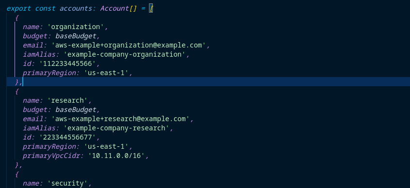
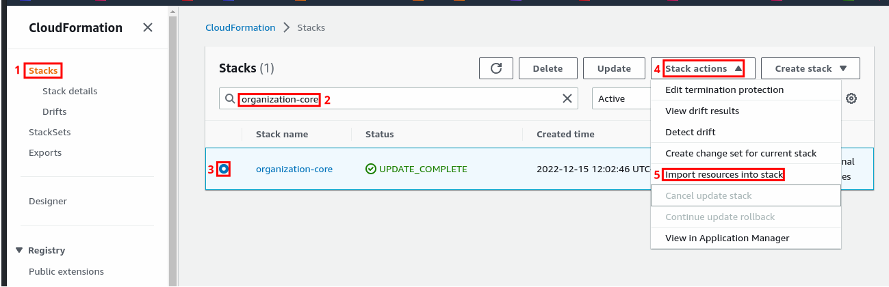
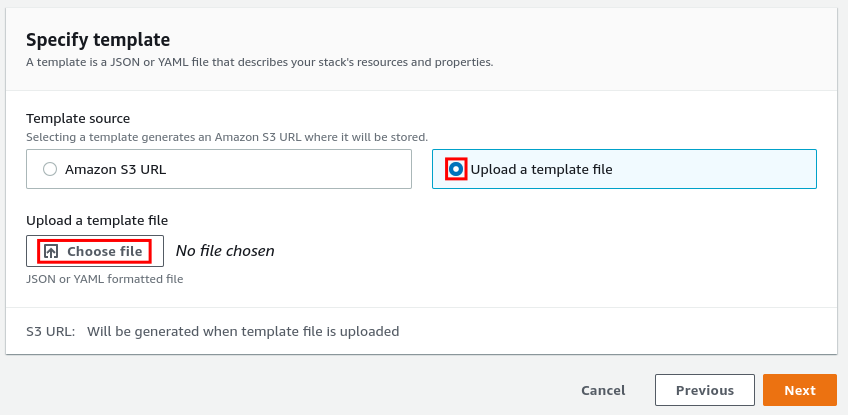
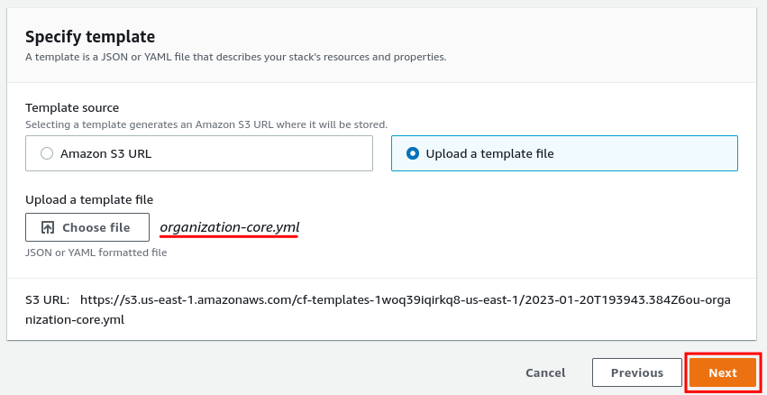
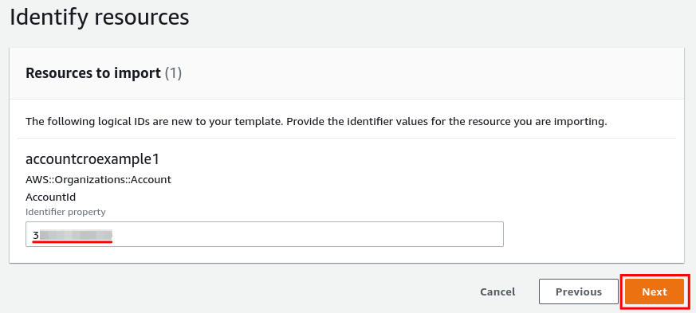
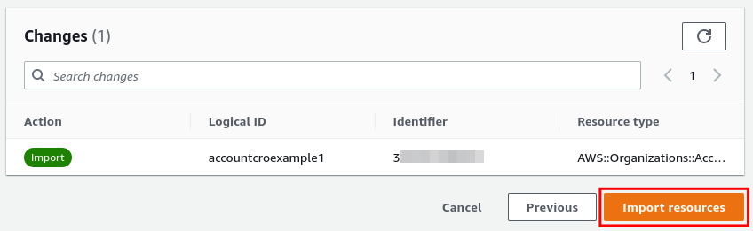

# Account Imports

- [Account Imports](#account-imports)
  - [Prerequisites](#prerequisites)
  - [Import Process](#import-process)
    - [Update the Core Config File](#update-the-core-config-file)
    - [Synthesize the organization-core stack](#synthesize-the-organization-core-stack)
    - [CloudFormation Console Import](#cloudformation-console-import)

Existing accounts can be imported into the Simple Cloud Accelerator after the SCA has been deployed. To invite existing accounts into the new AWS Organization, follow the [AWS instructions](https://docs.aws.amazon.com/organizations/latest/userguide/orgs_manage_accounts_invites.html).

If you are inviting an account that was previously a single account AWS Organization or the Management account of an Organization, you will need to [delete the Organization](https://docs.aws.amazon.com/organizations/latest/userguide/orgs_manage_org_delete.html) before sending an invitation to the SCA Organization.

## Prerequisites

The following details are required for a proper import:

- The SCA has already been deployed.
  - _NOTE: If you have not yet completed the initial SCA deployment, refer to the [Initial Deployment Guide](../../deployment/initial-deployment.md) before continuing._
- The account must have been invited into the SCA Organization.
- The invitation must be accepted.
- Account name from AWS Organizations.
- AWS Account ID for the imported account.
- AWS Root account email address for the imported account.
- Account must **not** be in an Organizational Unit.

## Import Process

In this example, we'll import an account with the following details:

| Name          | AWS Account ID | Root Email Address                    |
| ------------- | -------------- | ------------------------------------- |
| CRO Example 1 | 399999999999   | aws-example+cro-example-1@example.com |

### Update the Core Config File



### Synthesize the organization-core stack

From the top directory of the repository, we'll need to `synth` the `organization-core` stack:

```shell
export AWS_PROFILE=<ORGANIZATION_admin_profile>
npx cdk synth organization-core > organization-core.yml
```

This operation synthesizes the CDK code into the YAML that the CloudFormation service will ingest.

**Before deploying**, a single line in the YAML file **MUST** be updated. The CDK maintains some base64 encoded and gzipped metadata in each CloudFormation stack at the following location:

```yaml
Resources:
  CDKMetadata:
    Type: AWS::CDK::Metadata
    Properties:
      Analytics: <payload-encoding>:<payload>
```

Because we'll be importing this YAML file into CloudFormation, and CloudFormation does not support updating the `CDKMetadata` resource, we cannot update the `Analytics` property.

To work around this, we'll collect the metadata from the already deployed `organization-core` CloudFormation stack and substitute it in our synthesized stack.

```shell
# Get the existing Analytics metadata and escape any backslashes (/ becomes \/)
METADATA=$(aws cloudformation get-template \
  --stack-name organization-core \
  --query 'TemplateBody.Resources.CDKMetadata.Properties.Analytics' \
  --output text | sed 's#/#\\/#g')
# Substitute the existing metadata into the YAML on the disk
sed -i "s#v2:deflate64.*#$METADATA#" organization-core.yml
```

Now that the CDK metadata matches the previous deployment, we can import the account in the CloudFormation console.

### CloudFormation Console Import

Log into the Organization account via the console and navigate to the [CloudFormation console](https://console.aws.amazon.com/cloudformation/home). Begin by opening the **Stacks** list in the left column, then filtering the stack list for **organization-core**. Once selected, click the Stack actions button in the upper right, then click **Import resources into stack**.



Next, you'll specify a template to upload. Select the **Upload a template file** radio button, then click **Choose file**. Select the `organization-core.yml` that was created in the previous CDK synth step.



Confirm that the file appears appropriately in the window and click **Next**.



In the next step, you'll see a single resource to import. In this example, we've pasted in the AWS account ID that of the `CRO Example 1` account. Paste in the proper account ID, then click **Next**.



Finally, scroll to the bottom of the next screen and review the `Changes` section. Review the import details and click **Import resources** to complete the import.



Once the account has been created, proceed to the [account baseline deployment docs](./baseline.md) to complete the account baseline configuration.
