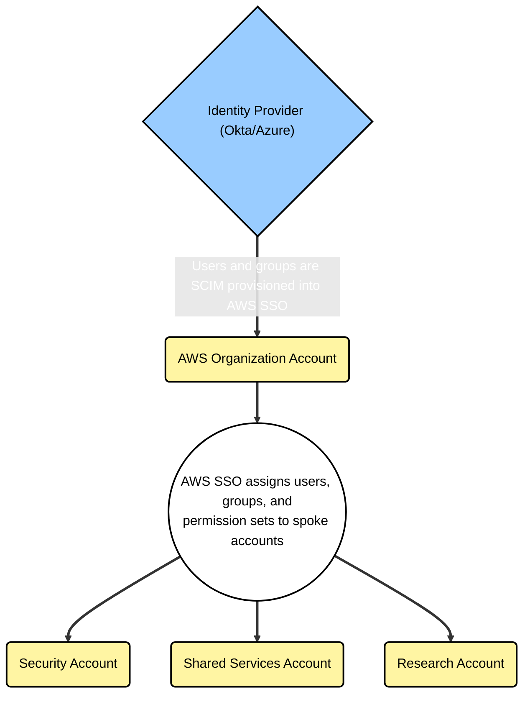
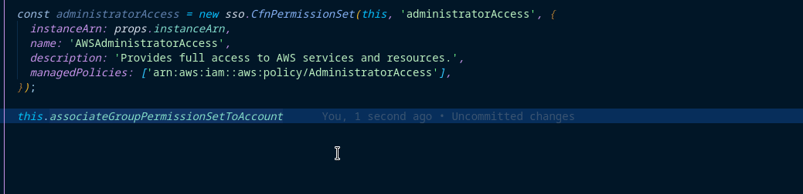

# AWS IAM Identity Center Implementation

This section provides an overview of the AWS SSO implementation and reference documentation for common operations.

- [AWS IAM Identity Center Implementation](#aws-iam-identity-center-implementation)
  - [Architecture](#architecture)
  - [Common Operations](#common-operations)
    - [Group ID Collection](#group-id-collection)
    - [Permission Set Creation and Assignment](#permission-set-creation-and-assignment)
    - [Stack Updates](#stack-updates)

## Architecture

The Identity Provider (IdP) is the source of truth for users in AWS. Users and groups are assigned to the AWS application in the IdP. Once assigned, the users and groups are [SCIM](https://docs.aws.amazon.com/singlesignon/latest/userguide/scim-profile-saml.html) provisioned into the AWS SSO directory. This SCIM provisioning happens at a cadence set by the IdP. Review your IdP documentation to see how frequently new users are synced.

Post-SCIM provisioning, AWS account access and permissions are managed in AWS SSO. Permission sets are assigned to groups and accounts.



## Common Operations

This section documents common operations to enable management of AWS SSO via the CDK.

### Group ID Collection

When a new group is SCIM-provisioned, a UUID is generated inside AWS SSO. That UUID is required for the CDK to manage group to permission set to account assignments. The Simple Cloud Accelerator (SCA) uses the [ssoConfig.ts](../../../config/ssoConfig.ts) file to reference the group to UUID mapping.

Example `ssoConfig.ts` file:

```typescript
export const ssoDetails = {
  instanceArn: "arn:aws:sso:::instance/ssoins-9999999999999999",
  groupIds: {
    "aws-sso-admin-all": "b4d8a4c8-9999-9999-9999-6e24b14f61f9",
    "aws-sso-organization-admin": "e4184498-9999-9999-9999-871f2d1786e9",
    "aws-sso-organization-readonly": "e4e8f4e8-9999-9999-9999-ade06c533241",
    "aws-sso-security-admin": "a4c80458-9999-9999-9999-a2713aef03a9",
    "aws-sso-security-readonly": "0488f4f8-9999-9999-9999-f344e9ee56a8",
    "aws-sso-shared-services-admin": "e4184488-9999-9999-9999-ee90539d8070",
    "aws-sso-shared-services-readonly": "c428e4b8-9999-9999-9999-d026510cedc3",
  },
} as const;
```

To update this file, use the `npm run sso-update` command below. This command executes the [scripts/aws-sso-list-groups.ts](../../../scripts/aws-sso-list-groups.ts) script. The script will use your AWS credentials to poll the Organization account and update the file with the latest configuration.

This example is run from the **root directory** of the repository:

```shell
AWS_PROFILE=<your_organization_admin_profile> npm run sso-update
```

Once the mappings have been updated, you can continue with other operations.

### Permission Set Creation and Assignment

Permission sets are managed directly in the Organization accounts file, [lib/environments/organization/sso.ts](../../../lib/environments/organization/sso.ts), and leverage the CDK [cfnPermissionSet construct](https://docs.aws.amazon.com/cdk/api/v2/docs/aws-cdk-lib.aws_sso.CfnPermissionSet.html).

The following example shows the AWS-managed `AdministratorAccess` policy creation and subsequent application to the `aws-sso-admin-all` group in _all_ accounts:

```typescript
const administratorAccess = new sso.CfnPermissionSet(this, "administratorAccess", {
  instanceArn: props.instanceArn,
  name: "AWSAdministratorAccess",
  description: "Provides full access to AWS services and resources.",
  managedPolicies: ["arn:aws:iam::aws:policy/AdministratorAccess"],
});

this.associateGroupPermissionSetToAccount(groupIds["aws-sso-admin-all"], administratorAccess, "ALL_ACCOUNTS");
```

Alternatively, if you're creating a permission set with specific IAM requirements, the example below combines an AWS managed policy with an inline policy to extend access. The permission set is then linked with the `aws-sso-example-account-1` SSO group and assigned to the `example-account-1` account:

```typescript
const ec2examplePermissionSet = new sso.CfnPermissionSet(this, "ec2examplePermissionSet", {
  instanceArn: props.instanceArn,
  name: "ec2-start-stop-user",
  description: "Read only EC2 access with start stop and reboot",
  managedPolicies: ["arn:aws:iam::aws:policy/AmazonEC2ReadOnlyAccess"],
  inlinePolicy: {
    Version: "2012-10-17",
    Statement: [
      {
        Sid: "manageInstances",
        Effect: "Allow",
        Action: ["ec2:RebootInstances", "ec2:StartInstances", "ec2:StopInstances"],
        Resource: "*",
      },
    ],
  },
});
this.associateGroupPermissionSetToAccount(groupIds["aws-sso-example-account-1"], ec2examplePermissionSet, [
  "example-account-1",
]);
```

When creating new permission sets, use the example above as your guide. The association method (`associateGroupPermissionSetToAccount`) relies heavily on your IDE's intellisense to infer the available values. The example below uses VSCode, but your experience will vary across different IDEs. Once you begin to type the method's name, VSCode's intellisense will auto-populate the allowed values as shown below.



### Stack Updates

After making changes to the SSO stack, deploy the updates by running the following:

```shell
# Optionally run a diff to review your changes
AWS_PROFILE=<your_organization_admin_profile> cdk diff sso

# Followed by a deployment
AWS_PROFILE=<your_organization_admin_profile> cdk deploy sso
```
