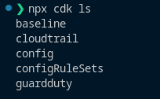
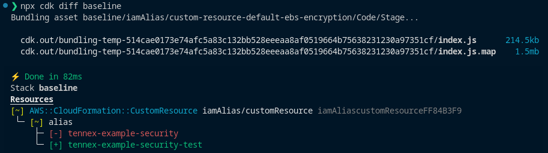
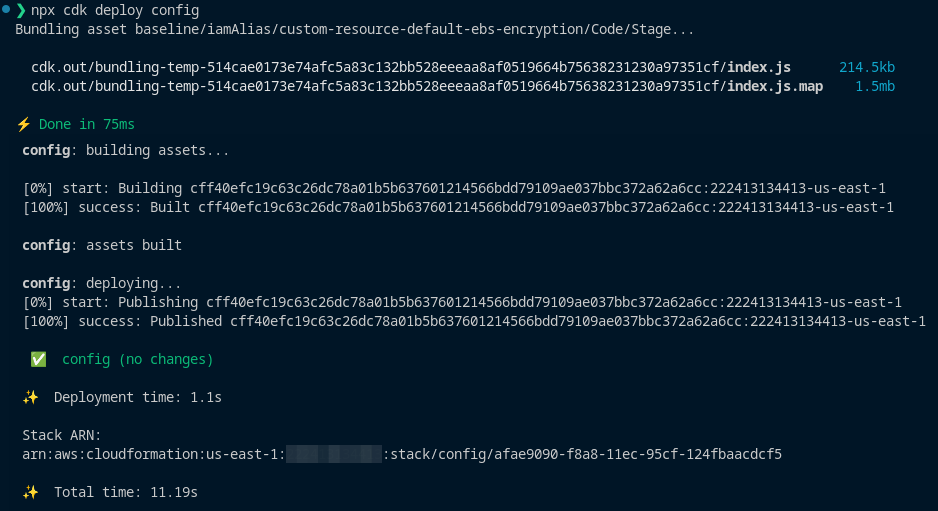

# Deployment Operations

This section provides an overview of deployment operations that will be performed in the environment. The [CDK CLI documentation](https://docs.aws.amazon.com/cdk/v2/guide/cli.html#cli-commands) provides helpful context for the scenarios below.

- [Deployment Operations](#deployment-operations)
  - [Listing Account Stacks](#listing-account-stacks)
  - [Stack Differences By Account](#stack-differences-by-account)
  - [Deploy Stacks](#deploy-stacks)
  - [Deploy to a non-default AWS Region](#deploy-to-a-non-default-aws-region)

## Listing Account Stacks

An `ls` operation will list the stacks present in the environment. Set the `AWS_PROFILE` environment variable to match the account in which you'd like to operate.

  ```shell
  export AWS_PROFILE=<SECURITY_admin_profile>
  npx cdk ls
  ```

  _Example Screenshot:_

  

## Stack Differences By Account

A `diff` operation will show changes staged in the environment. Set the `AWS_PROFILE` environment variable to match the account in which you'd like to operate.

  ```shell
  export AWS_PROFILE=<SECURITY_admin_profile>

  # List all stacks in the security account
  npx cdk ls

  # Diff the security account baseline stack
  npx cdk diff baseline

  # Optionally diff all stacks in the security account
  npx cdk diff --all
  ```

In this example, only the IAM alias would be updated. The bundling of resources is normal.

  _Example Screenshot:_

  

## Deploy Stacks

A `deploy` operation will deploy changes to the AWS account. To prevent unintended consequences, it is **highly recommended** that you execute a `diff` prior to deploying. See the preceding section for more details.

Set the `AWS_PROFILE` environment variable to match the account in which you'd like to operate.

  ```shell
  export AWS_PROFILE=<SECURITY_admin_profile>
  # List all stacks in the account
  npx cdk ls

  # Deploy an existing stack
  npx cdk deploy config

  # Deploy an new stack
  npx cdk deploy aNewStack

  # Optionally deploy all stacks
  npx cdk deploy --all
  ```

The bundling of resources is normal. There are no changes to the `config` stack.

  _Example Screenshot:_

  

## Deploy to a non-default AWS Region

By default, stacks are deployed in the region specified by your AWS CLI profile. For stacks located in a different region, confirm your stack is in the proper location on the file system (`bin/account-stacks/us-east-1`, for example) and explicitly set the `AWS_REGION` environment variable on the CLI.

Example

  ```shell
  # Deploy an stack named 'example' in us-east-1
  AWS_REGION=us-east-1 npx cdk deploy example
  ```
