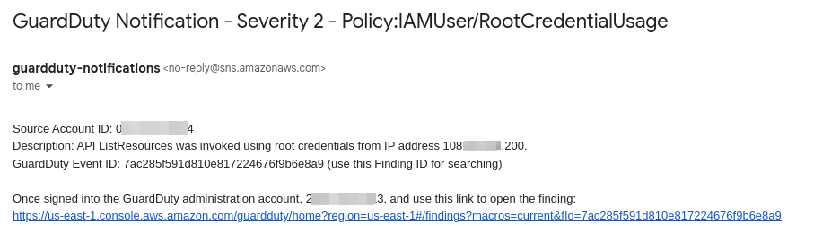

# Amazon GuardDuty

This section provides an overview of the [Amazon GuardDuty](https://aws.amazon.com/guardduty/) implementation and associated alerting options.

- [Amazon GuardDuty](#amazon-guardduty)
  - [Architecture](#architecture)
  - [Common Operations](#common-operations)
    - [Adding/Modifying Alert Recipients](#addingmodifying-alert-recipients)
    - [Changing the Minimum Alerting Threshold](#changing-the-minimum-alerting-threshold)
    - [Stack Updates](#stack-updates)

## Architecture

The Organization account delegates GuardDuty management to the Security account. All management and alerting configurations are managed via the Security account.

GuardDuty continuously monitors AWS CloudTrail event logs, DNS logs, and VPC flowlogs for all accounts in the Organization. In addition, [S3 Protection](https://docs.aws.amazon.com/guardduty/latest/ug/s3-protection.html) is enabled for all accounts automatically.

Users can select the minimum threshold for alerting in the `guardDutyDetails` object of the [core configuration file](../../../config/coreConfig.ts). When GuardDuty makes a new finding, the finding is classified as one of LOW, MEDIUM, or HIGH priority. To review the finding thresholds, review the [Amazon GuardDuty documentation](https://docs.aws.amazon.com/guardduty/latest/ug/guardduty_findings.html).

When an alert is generated which meets the minimum finding threshold, the finding is formatted via a [Lambda function](../../../lib/environments/security/lambda/guarddutySns.ts) and then delivered to and SNS topic. The Lambda function translates the standard alert into a human-readable format, with an easily filtered for subject, handy links to relevant information, and all the necessary context to evaluate the finding quickly.



## Common Operations

This section documents common GuardDuty operations.

### Adding/Modifying Alert Recipients

Consider the following GuardDuty entry in the core configuration file:

```typescript
export const guardDutyDetails: GuardDutyDetails = {
  securityAccountDetectorId: "5ac23e4339999999999999908e9b47eb",
  minimumFindingSeverity: GuardDutySeverity.MEDIUM,
  snsAlertEmails: ["aws-root+guardduty-alerts@example.com"],
};
```

Adjust the entires in the `snsAlertEmails` array to add or remove the desired email targets.

```typescript
  snsAlertEmails: [
    'aws-root+guardduty-alerts@example.com',
    'additional-user@example.com',
  ],
```

Once complete, execute a [stack update](#stack-updates).

### Changing the Minimum Alerting Threshold

Alerting thresholds are adjusted in the [core configuration file](../../../config/coreConfig.ts). To review the specifications for GuardDuty finding thresholds, visit the [AWS documentation](https://docs.aws.amazon.com/guardduty/latest/ug/guardduty_findings.html),

Consider the following GuardDuty entry in the core configuration file:

```typescript
export const guardDutyDetails: GuardDutyDetails = {
  securityAccountDetectorId: "5ac23e4339999999999999908e9b47eb",
  minimumFindingSeverity: GuardDutySeverity.LOW,
  snsAlertEmails: ["aws-root+guardduty-alerts@example.com"],
};
```

The `minimumFindingSeverity` can be set to:

- GuardDutySeverity.LOW
- GuardDutySeverity.MEDIUM
- GuardDutySeverity.HIGH

After adjusting to the minimum desired threshold you'd like to be alerted for, run a stack update.

### Stack Updates

After making changes to GuardDuty settings, deploy the updates by running the following:

```shell
# Optionally run a diff to review your changes
AWS_PROFILE=<SECURITY_admin_profile> cdk diff guardduty

# Followed by a deployment
AWS_PROFILE=<SECURITY_admin_profile> cdk deploy guardduty
```
