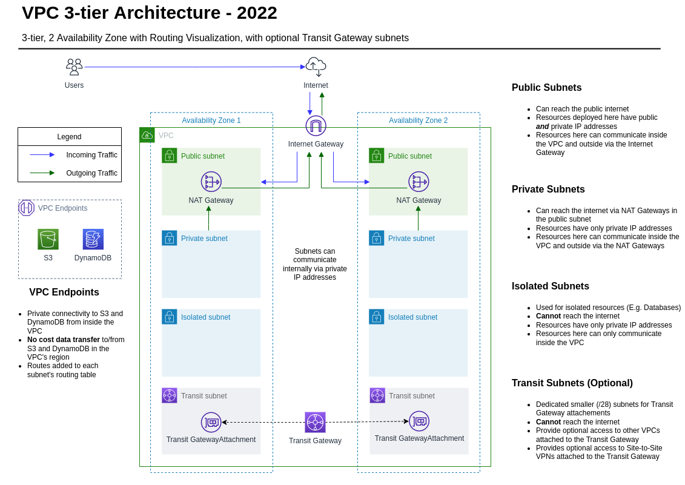
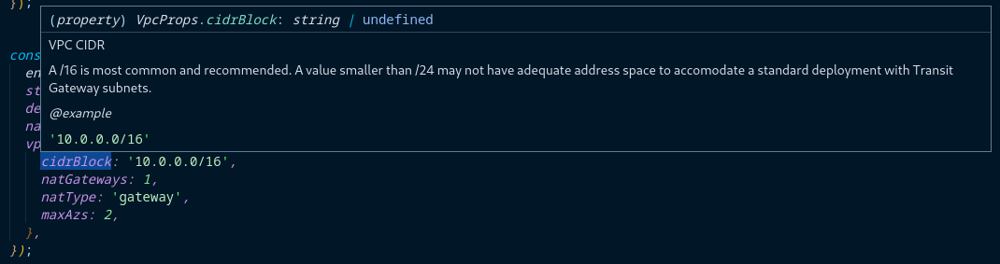

# Networking Overview

This section provides an overview of the solution's overall networking posture, as well as descriptions off and additional context for the VPC structure.

- [Networking Overview](#networking-overview)
  - [VPC Architecture](#vpc-architecture)
    - [Subnet Structure](#subnet-structure)
  - [Common Operations](#common-operations)
    - [Prerequisites](#prerequisites)
    - [Development VPC Deployment (2 AZ, single NAT instance in 1 AZ)](#development-vpc-deployment-2-az-single-nat-instance-in-1-az)
    - [Production VPC Deployment (2 AZ, 2 NAT Gateways, Highly Available)](#production-vpc-deployment-2-az-2-nat-gateways-highly-available)
    - [VPC with Connectivity to the Transit Gateway](#vpc-with-connectivity-to-the-transit-gateway)
    - [Adding NACLs](#adding-nacls)
      - [Single NACL Entry - All Protocols](#single-nacl-entry---all-protocols)
      - [Single NACL Entry - Specific Protocol and Port Range](#single-nacl-entry---specific-protocol-and-port-range)
      - [Single NACL Entry - Egress](#single-nacl-entry---egress)
      - [Multiple NACL Entries - Loops](#multiple-nacl-entries---loops)
    - [Stack Updates](#stack-updates)

## VPC Architecture

This VPC employs a best practices, 3-tier architecture across several Availability Zones (AZs). For cross-account connectivity, Transit Gateway subnets (optional) may be added. Private subnets can route to the Internet via NAT Gateways or NAT instances. For production workloads, 1 NAT Gateway per AZ is recommended to maintain high availability.

Each subnet in the VPC has both Amazon S3 and Amazon DynamoDB [gateway endpoints](https://docs.aws.amazon.com/vpc/latest/privatelink/gateway-endpoints.html). These services reside outside the VPC and, under normal circumstances, traffic destined for the services would need to egress the VPC and traverse the public internet in order to reach its destination at either S3 or DynamoDB. Gateway endpoints are free of charge and localize traffic inside the AWS network. Traffic originating in a private subnet that is destined for S3 or DynamoDB travels over the endpoint instead of through the NAT Gateway and out to the public internet. These endpoints both improve security and prevent excessive NAT gateway costs by keeping traffic destined for AWS services inside the AWS network.

The diagram below highlights the VPC subnet structure and routing:



### Subnet Structure

- **Public subnets** have direct access to the public internet via an Internet Gateway (IGW) and generally host services such as load balancers and NAT Gateways. It is not recommended to launch end-user resources in these subnets.
- **Private subnets** host most resources launched in a VPC which require access to the public internet for updates and communications, but are still protected from outside access via a NAT Gateway.
- **Isolated subnets** are created to host managed data services from AWS such as RDS and OpenSearch. These subnets do not have any route to the public internet.
- **Transit subnets** are created for Transit Gateway attachments per the AWS Transit Gateway [best practices](https://docs.aws.amazon.com/vpc/latest/tgw/tgw-best-design-practices.html).

## Common Operations

The VPC is deployed as a standalone stack. Deploying as a standalone stack allows stack outputs to be referenced by other stacks in the environment. This section documents common VPC configurations.

Also, keep in mind that, for each property in the VPC stack, you can take advantage the built-in IntelliSense documentation for context and examples.

_Example Screenshot_:



### Prerequisites

The VPC stack, account detail helper function, and several types must be imported at the top of the file containing your stacks:

```typescript
import { Vpc } from "@common/vpc";
import { getAccountFromShortName } from "@helpers/accounts";
import { Account, friendlySubnetType, protocol } from "@lib/types";
```

### Development VPC Deployment (2 AZ, single NAT instance in 1 AZ)

Development environments will typically mirror the number of Availability Zones of production environments but do not have the same requirements for being highly available. This configuration mirrors the number of AZs but uses only a single NAT gateway to allow private subnets internet access:

```typescript
const vpc = new Vpc(app, "vpc", {
  env,
  stackName: "development-vpc",
  description: "primary VPC",
  name: "development-vpc1",
  vpcProps: {
    cidrBlock: "10.0.0.0/16",
    natGateways: 1,
    natType: "gateway",
    maxAzs: 2,
  },
});
```

If you'd prefer a small EC2 NAT instance over an AWS-managed NAT Gateway, change `natType` from `gateway` to `instance`.

### Production VPC Deployment (2 AZ, 2 NAT Gateways, Highly Available)

This deployment type maintains networking parity between Availability Zones. With a NAT Gateway in each AZ, a failure of an AZ would not impact the network functionality of the overall deployment.

```typescript
const vpc = new Vpc(app, "vpc", {
  env,
  stackName: "production-vpc",
  description: "primary VPC",
  name: "production-vpc1",
  vpcProps: {
    cidrBlock: "10.1.0.0/16",
    natGateways: 2,
    natType: "gateway",
    maxAzs: 2,
  },
});
```

### VPC with Connectivity to the Transit Gateway

This example deploys a VPC with the following specifications:

- Connectivity to two spoke networks via a Transit Gateway. (The Transit Gateway ID is automatically retrieved from an AWS Secrets Manager secret in the `shared-services` account.)
- A route to an on-premises CIDR from the private subnets.
- A route to the primary VPC CIDR for the `example` account for the isolated subnets.
- NACLs allowing access to those CIDRs on the respective subnets.

```typescript
  const onPremisesCidrs = ['10.0.130.0/26', '192.168.250.0/24'];
  // The primary VPC CIDR of the example account will be used multiple times
  const exampleAccountCidr = getAccountFromShortName('example').primaryVpcCidr!

  const vpc = new Vpc(app, 'vpc', {
    env,
    stackName: 'production-vpc',
    description: 'primary VPC',
    name: 'production-vpc1',
    vpcProps: {
      cidrBlock: `10.1.0.0/16`,
      natGateways: 2,
      natType: 'gateway',
      maxAzs: 2,
      transitGatewayProps: {
        sharedAccountSecretPartialArn: `arn:aws:secretsmanager:${env.region}:${getAccountFromShortName('shared-services').id}:secret:transitGateway`,
        routes: {
          private: onPremisesCidrs,
          isolated: [exampleAccountCidr],
        }
      }
    },
  });
  // Allow access from on-prem CIDRs to private subnets
  onPremisesCidrs.forEach((cidr, index) => {
    vpc.addNaclToSubnetType(friendlySubnetType.private, {
      action: 'allow',
      cidr: cidr,
      protocol: protocol.all,
      ruleNumber: 500 + index,
  });
  // Allow access from the example account VPC to isolated subnets
  vpc.addNaclToSubnetType(friendlySubnetType.isolated, {
    action: 'allow',
    cidr: exampleAccountCidr,
    protocol: protocol.all,
    ruleNumber: 500,
  });
```

**Note:**

- In the above example, the `Vpc` _stack_ (note the capital `V`) is a class, and it is assigned to the `vpc` _variable_ (note the lower case `v`).
- The `addNaclToSubnetType()` method exists on the stack class. (It is not a property in the stack.)

### Adding NACLs

NACLs can be added to each specific subnet type using the `addNaclToSubnetType()` method on the VPC stack. It is important to note that each NACL must have a unique `ruleNumber` and that these rule numbers are evaluated in ascending order.

In the following examples, consider a VPC stack that has been assigned to a variable called `exampleVar`:

```typescript
const exampleVar = new Vpc(app, 'vpc', {
  ...snip..
});
```

#### Single NACL Entry - All Protocols

This entry sets a rule with a priority of 500 to allow all protocols (TCP/UDP/ICMP) from the 10.0.0.0/16 CIDR range to the VPCs private subnets:

```typescript
exampleVar.addNaclToSubnetType(friendlySubnetType.private, {
  action: "allow",
  cidr: "10.0.0.0/16",
  protocol: protocol.all,
  ruleNumber: 500,
});
```

#### Single NACL Entry - Specific Protocol and Port Range

This entry sets a rule with a priority of 500 to allow TCP ports 1024-65535 from the 10.0.0.0/16 CIDR range to the VPC's private subnets:

```typescript
exampleVar.addNaclToSubnetType(friendlySubnetType.private, {
  action: "allow",
  cidr: "10.0.0.0/16",
  portRange: {
    from: 1024,
    to: 65535,
  },
  protocol: protocol.tcp,
  ruleNumber: 500,
});
```

#### Single NACL Entry - Egress

Simple Cloud Accelerator (SCA) outbound NACLs are open by default. If you should change the networking posture to granular egress rules, this example allows TCP ephemeral ports (1024-65536) from the public subnets to the internet:

```typescript
exampleVar.addNaclToSubnetType(friendlySubnetType.public, {
  action: "allow",
  cidr: "10.0.0.0/16",
  egress: true,
  portRange: {
    from: 1024,
    to: 65535,
  },
  protocol: protocol.tcp,
  ruleNumber: 500,
});
```

#### Multiple NACL Entries - Loops

When you have a list of CIDR ranges that you'd like to add entries for, you can use a `forEach()` method on an array. Rule numbers are incremented by an index on the `forEach()` method:

```typescript
  const onPremisesCidrs = ['10.20.0.0/24', '192.168.50.0/24'];
  onPremisesCidrs.forEach((cidr, index) => {
    vpc.addNaclToSubnetType(friendlySubnetType.private, {
      action: 'allow',
      cidr: cidr,
      protocol: protocol.all,
      ruleNumber: 500 + index,
  });
```

The above snippet will generate two ingress NACLs allowing all protocols to the private subnets. The resulting rules will be:

| Rule number | Type        | Protocol | Port range | Source           | Allow/Deny |
| ----------- | ----------- | -------- | ---------- | ---------------- | ---------- |
| 500         | All traffic | All      | All        | 10.0.130.0/26    | Allow      |
| 501         | All traffic | All      | All        | 192.168.250.0/24 | Allow      |

### Stack Updates

After making changes to any VPC, deploy the updates by running the following:

```shell
# Optionally run a diff to review your changes
AWS_PROFILE=<your_admin_profile> cdk diff <vpc_stack_name>

# Followed by a deployment
AWS_PROFILE=<your_admin_profile> cdk deploy <vpc_stack_name>
```
