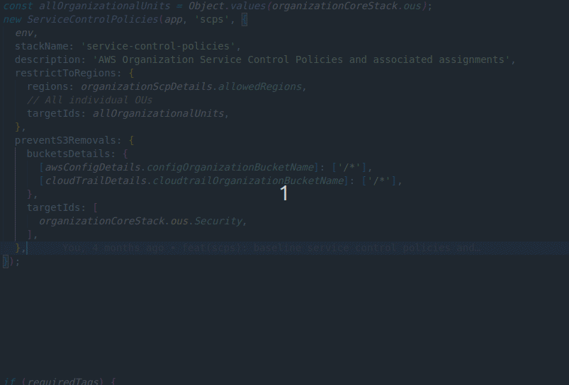
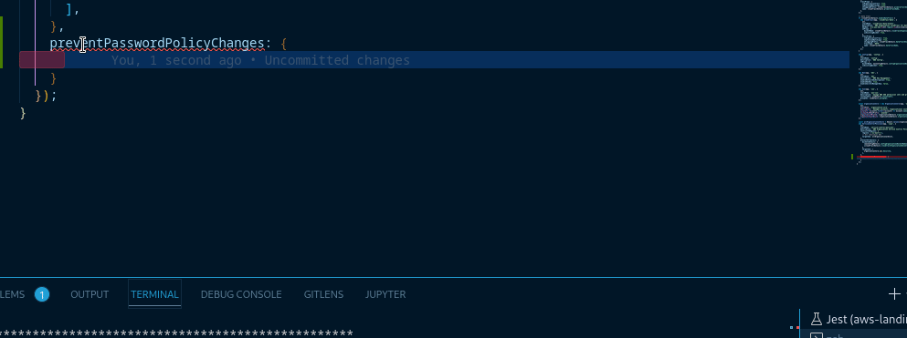

# AWS Organization Service Control Policies (SCPs)

This section provides an overview of the AWS Organization [service control policies](https://docs.aws.amazon.com/organizations/latest/userguide/orgs_manage_policies_scps.html) (SCPs) and their application in the overall solution. SCPs can be assigned to any combination of accounts or Organizational Units.

- [AWS Organization Service Control Policies (SCPs)](#aws-organization-service-control-policies-scps)
  - [Architecture](#architecture)
  - [Common Operations](#common-operations)
    - [Stack Updates](#stack-updates)

## Architecture

SCPs are created and managed in the AWS Organization management account. Policies are wrapped in basic functions to convert them to strings that CloudFormation can consume. To review the SCPs in code, visit [lib/environments/organization/service-control-policies.ts](../../../lib/environments/organization/serviceControlPolicies.ts). For a text-based breakdown of each rule, review the table below:

| Name                            | Description                                                                                            | Applied to by default                                     |
| ------------------------------- | ------------------------------------------------------------------------------------------------------ | --------------------------------------------------------- |
| Prevent disabling CloudTrail    | CloudTrail cannot be disabled or deleted.                                                              | Organization Management Account                           |
| Prevent disabling AWS Config    | Config recording cannot be stopped or deleted. Config rules cannot be deleted.                         | Security Account                                          |
| Prevent disabling GuardDuty     | Member accounts cannot be removed or have monitoring disabled. GuardDuty detector upgrades are denied. | Security Account                                          |
| Prevent Organization exit       | Accounts in the AWS Organization cannot leave the AWS Organization.                                    | None                                                      |
| Prevent password policy changes | The IAM password policy cannot be changed.                                                             | All OUs, Organization Management Account.                 |
| Prevent AWS root account usage  | Usage of the AWS root account is denied.                                                               | None                                                      |
| Prevent S3 removals             | Prevents specific S3 buckets and their paths from being removed.                                       | Security Account CloudTrail and Config S3 buckets         |
| Restrict to specific Regions    | Regions outside a specific set are disabled.                                                           | us-east-1 for Organization Management account and All OUs |

At a code level, the application of an SCP is facilitated via additional stack properties.

Consider this example, from the [bin/account-stacks/us-east-1/organization.ts](../../../bin/account-stacks/us-east-1/organization.ts) file:

```typescript
const allOrganizationalUnits = Object.values(organizationCore.ous);
new ServiceControlPolicies(app, "scps", {
  env,
  stackName: "service-control-policies",
  description: "AWS Organization Service Control Policies and associated assignments",
  restrictToRegions: {
    regions: ["us-east-1"],
    // All individual OUs
    targetIds: allOrganizationalUnits,
  },
  preventS3Removals: {
    bucketsDetails: {
      [awsConfigDetails.configOrganizationBucketName]: ["/*"],
      [cloudTrailDetails.cloudtrailOrganizationBucketName]: ["/*"],
    },
    targetIds: [organizationCore.ous.Security],
  },
});
```

In the above example, two SCPs are created and assigned to targets (`prevents3removals` and `restrictToRegions`). We can use VSCode's Intellisense to explore the other available SCPs. Below, accounts in the Security OU are restricted from leaving the organization. The list of OUs is inferred from the output of the Organization Core stack. The strong typing allows the IDE to limit the inputs to allowed values, making it easier for the operator to understand what arguments are allowed and where.



## Common Operations

Enabling and assigning SCPs can be done in your IDE following the example in the animation above. Many interfaces include a description and examples to offer guidance. The example below uses VSCode, but your experience will vary across different IDEs. As you use Intellisense to explore the interface in VSCode, take advantage of the "Ctrl + Space" shortcut to read the documentation associated with the input.



### Stack Updates

After making any SCP modifications, deploy the updates by running the following:

```shell
# Optionally run a diff to review your changes
AWS_PROFILE=<your_organization_admin_profile> cdk diff scps

# Followed by a deployment
AWS_PROFILE=<your_organization_admin_profile> cdk deploy scps
```
